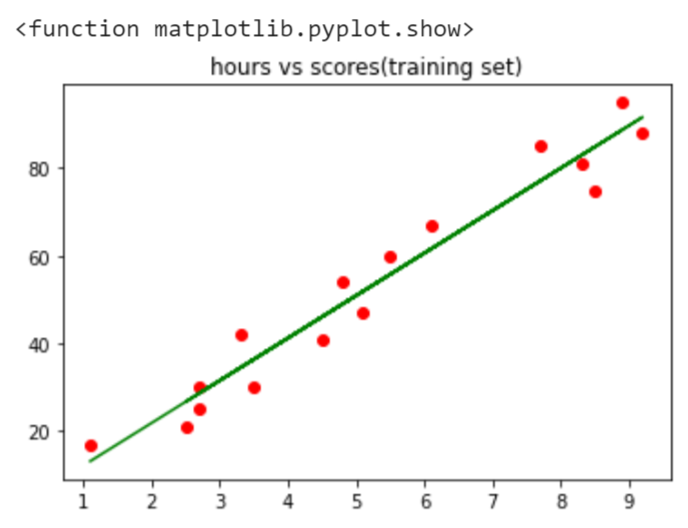

# Implementation-of-Simple-Linear-Regression-Model-for-Predicting-the-Marks-Scored

## AIM:
To write a program to implement the simple linear regression model for predicting the marks scored.

## Equipments Required:
1. Hardware – PCs
2. Anaconda – Python 3.7 Installation / Moodle-Code Runner

## Algorithm
1.Import the standard Libraries.

2.Set variables for assigning dataset values.

3.Import linear regression from sklearn.

4.Assign the points for representing in the graph

5.Predict the regression for marks by using the representation of the graph.

6.Compare the graphs and hence we obtained the linear regression for the given datas.

## Program:
```
/*
Program to implement the linear regression using gradient descent.
Developed by: Lathika Sunder
RegisterNumber:  212221230054
*/
```
```

import numpy as np
import pandas as pd
import matplotlib.pyplot as plt
navy=pd.read_csv("/content/student_scores - student_scores.csv")
navy.head()
navy.isnull().sum()
a=navy.Hours
a.head()
n=len(a)
m=0
c=0
L=0.001
loss=[]
for i in range(10000):
  ypred=m*x+c
  MSE=(1/n)*sum((ypred-y)*2)
  dm=(2/n)*sum(x*(ypred-y))
  dc=(2/n)*sum(ypred-y)
  c=c-L*dc
  m=m-L*dm
  loss.append(MSE)
print(m,c)
y_pred=m*x+c
plt.scatter(x,y,color="purple")
plt.plot(x,y_pred)
plt.xlabel("study hours")
plt.ylabel("scores")
plt.title("study hours vs scores")
plt.plot(loss)
plt.xlabel("iterations")
plt.ylabel("loss")

```

## Output:



## Result:
Thus the program to implement the simple linear regression model for predicting the marks scored is written and verified using python programming.
